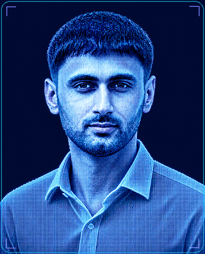

<table>
  <tr>
    <td width="32%" align="center" valign="top">

    </td>
    <td width="68%" valign="top">
      <h1>Hasnain Haider (Nain)</h1>
      <h2>Applied AI Researcher &amp; Full-Stack Engineer</h2>
      
<strong>Alor Setar, Malaysia</strong>

      
B.Sc. Computer Science at Albukhary International University, supported by a fully funded international scholarship.

      
<strong>Research:</strong> Applied ML · Agentic AI · Trustworthy AI · Computer Vision · Medical Imaging · RAG

      
<strong>Open to:</strong> Fully funded graduate research, international collaboration, AI/ML engineering, and full-stack roles.

      

        <a href="https://www.linkedin.com/in/hasnain-machinelearning-engineer/">LinkedIn</a> ·
        <a href="https://portfolio-red-two-21.vercel.app">Portfolio</a> ·
        <a href="mailto:hhnain1006@gmail.com">Email</a> ·
        <a href="mailto:hhnain1006@gmail.com?subject=CV%20Request">Request résumé</a>
      

    </td>
  </tr>
</table>

  <h2>Research Highlights</h2>

| Work | Focus | Evidence | Status |
|---|---|---|---|
| **Financial fraud detection** | Comparative evaluation of 12 models across three datasets | **0.9364 MCC** · **0.9904 PR-AUC** | Manuscript under review |
| **PalmSightCare** | On-device cataract detection for mobile medical imaging | **99.69% accuracy** · **25.9 ms** inference · **10.4 MB** on-device model | Manuscript under review |
| **TinyRAG** | Retrieval-augmented generation on a 16 GB CPU-only laptop | **95.2% Recall@5** · **0.868 MRR** | Manuscript in preparation |
| **Day90 Guardian** | Multi-agent orchestration with six connected agents | **2nd Place Overall in Asia** | Autopilot Asia Hackathon 2026 |

<h2>Publications & Manuscripts</h2>

1. **Financial fraud detection manuscript.** Comparative evaluation of 12 models across three datasets. Submitted to *IEEE Access*. **Status: Under review**
2. **Cataract detection manuscript.** PalmSightCare: on-device cataract detection for mobile devices. Submitted to *Biomedical Signal Processing and Control*. **Status: Under review**
3. **TinyRAG manuscript.** Evaluating retrieval-augmented generation on a 16 GB CPU-only laptop; targeting an *AAAI 2027 short paper*. **Status: In preparation**

  <h2>Featured Engineering Projects</h2>

| Project | Architecture | Outcome |
|---|---|---|
| [**Day90 Guardian**](https://github.com/Hasnain006-nain/day90-guardian-command-center) | Multi-agent orchestration with Supabase, Slack, and Asana integrations | Evaluates day-90 employee risk and creates Slack alerts and Asana tasks for HR follow-up |
| [**Credit-Card Fraud Detection**](https://github.com/Hasnain006-nain/Credit-Card-Fraud-Detection) | End-to-end ML evaluation and explainability | Evaluates fraud detection and explains model predictions |
| [**Plant Disease Detection**](https://github.com/Hasnain006-nain/Plant-disease-detection-CNN) | Computer vision and transfer learning | Classifies plant disease from leaf images |
| [**Biometric Attendance System**](https://github.com/Hasnain006-nain/Face-Recognition-Attendance-System) | Real-time OpenCV application with persistent attendance records | Automates attendance capture and stores attendance records |

  <h2>Expertise</h2>

| Research & AI | Software Engineering |
|---|---|
| Agentic systems, RAG, PyTorch, TensorFlow, Scikit-learn, XGBoost, SHAP, experimental design, statistical testing, computer vision, NLP | Python, React, Next.js, Node.js, Express, Django, Flask, Flutter, REST APIs, PostgreSQL, MySQL, MongoDB, Supabase, Docker, Git, Linux, AWS |

  <h2>Experience & Education</h2>

- **Research Assistant** · Albukhary International University · 2026-present
- **Data & Performance Strategy Analyst** · Maybank Global Ambassador · Mar-Nov 2025
- **Presenter** · ATx Singapore 2025
- **Data Analytics & Machine Learning Intern** · Digital Empowerment Pakistan · Jul 2024
- **B.Sc. Computer Science** · Albukhary International University · fully funded international scholarship · 2024-2027

  <h2>GitHub Activity</h2>

  
  

I welcome professor contact, research collaboration, and relevant AI/ML or full-stack opportunities: [Email](mailto:hhnain1006@gmail.com) · [LinkedIn](https://www.linkedin.com/in/hasnain-machinelearning-engineer/) · [Portfolio](https://portfolio-red-two-21.vercel.app).
